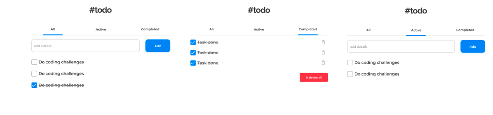

1. Bạn hãy tạo ứng dụng todo app. Sử dụng javascript và hoàn thành các user stories sau:

- **User story 1:** User có thể thêm task mới.
- **User story 2:** User có thể hoàn thành task đó.
- **User story 3:** User có thể chuyên giữa All, Active, Complete.
- **User story 4:** User có thể xoá 1 hoặc tất cả các task đang có.
- **User story (optional):** Sử dụng local storage để không bị mất dữ liệu mỗi khi loading lại trang web.

  

2. Quản Lý users
- Cho dữ liệu về users: source: users.js. Mỗi user gồm: id, first_name, last_name, email, password.
- Cho dữ liệu về posts: source: posts.js. Mỗi post gồm: id, title, content, image, created_at, updated_at, user_id.
- Hãy thực hiện theo các yêu cầu dưới đây:
a. Xây dựng chức năng đăng nhập
-Nhập vào email, password từ bàn phím. Nếu không nhập đủ thông tin → In ra “Hãy nhập đầy đủ thông tin”. Tìm trong dữ liệu users có user thỏa mãn email, password.

    +Nếu có user, in ra màn hình “Xin chào” + <tên đầy đủ của user đó>
  
    +Nếu không có user, in ra màn hình “Thông tin tài khoản không chính xác”.

b. Xây dựng chức năng đăng ký
-Nhập vào first_name, last_name, email, password từ bàn phím. Nếu không nhập đủ thông tin → In ra “Hãy nhập đầy đủ thông tin”. Tìm trong dữ liệu users có user có email đã nhập.

    +Nếu có user, in ra màn hình “Email này đã có tài khoản”.
    
    +Nếu không có user, thêm vào dữ liệu user những thông tin đã nhập. Id của user mới là số tự tăng và không trùng với user khác. 
    
c. Xây dựng chức năng xem danh sách users
-Nhập vào keyword. Hãy in ra những users có họ và tên hoặc email chứa keyword. Mỗi users hiển thị id, họ và tên, email.

    +Nếu keyword trống → In ra toàn bộ users
d. Xây dựng chức năng xem danh sách posts

-Hiển thị danh sách các posts, mỗi post bao gồm ID, title, ngày tạo, họ và tên người tạo.
e. Xây dựng chức năng xem chi tiết 1 post.

-Nhập vào ID của post. Hãy hiển thị thông tin của 1 post có ID tương ứng: ID, tiêu đề, nội dung, link ảnh, tên người tạo, ngày tạo, ngày sửa đổi.
f. Xây dựng chức năng tìm kiếm post theo user.

-Nhập vào email của 1 user. Hãy tìm kiếm các posts của user đó và hiển thị dưới dạng danh sách.